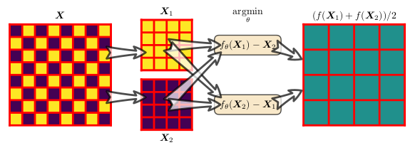

# Noise2Noise Binning

*Axel Ekman, Jian-Hua Chen, Venera Weinhardt, Gerry McDermott, Mark A. Le Gros, Carolyn Larabell*

As Presented by: [Axel Ekman](mailto:axel.ekman@iki.fi)
at 
[CAMERA Workshop](http://microct.lbl.gov/cameratomo2018)
October 31 - November 2, 2018

## Intro
In terms of signal processing, the optimal digital filter to remove the high-frequency portion of the image is the sinc filter. When decimation is doen by an integer factor, area-averaging is usually very close to optimal and produces usually not much aliasing. In this case, downsampling by a factor of 2 can be expressed in the from


Ideal filters like this are unbiassed and do not take into account any priors that may be suitable for the image. 

The basic idea of our method is, that we can construct separate signals from the data. This can be e.g. done by dividing each downsampled pixel into two diagonal regions (the fact that the center-of-mass is the same should take care of some sub-pixel artifacts, One could also choose random samples of the square to construct several permutations of the same image. In practice this made little difference in the results.)


##
Recent work of Lehtinen et al. show that instead of needing true signal, CNNs can be trained using just noisy images by minimizing some distance (loss function) L.


Based on 
[Noise2Noise: Learning Image Restoration without Clean Data](https://arxiv.org/abs/1803.04189)

```
Lehtinen, Jaakko, et al. “Noise2Noise: Learning Image Restoration without Clean Data.” <em>Proceedings of the 35th International Conference on Machine Learning, PMLR 80:2965-2974, 2018</em>.
```




### Example

